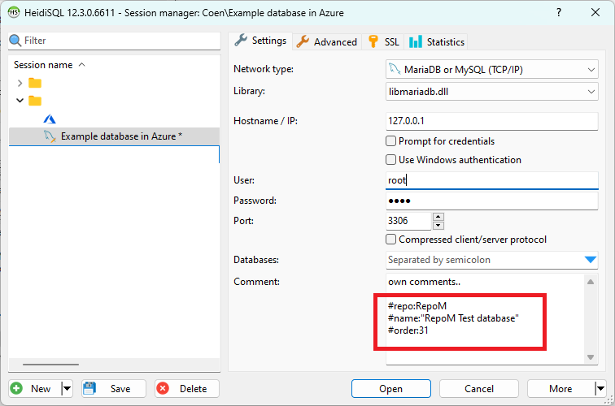
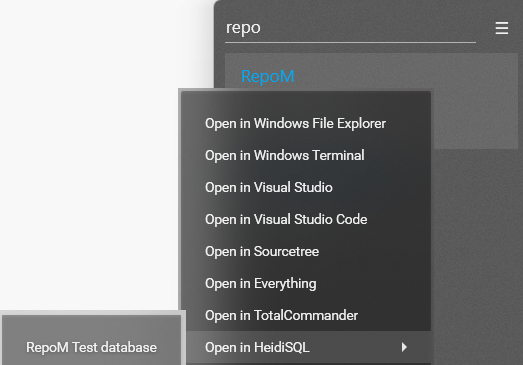

# Heidi

This module integrates with a portable [HeidiSQL](https://www.heidisql.com/) installation. The portable Heidi DB saves it's database configuration in a portable configuration file.
This module monitors this file and provides an action menu and a variable provider to access this information.

To use this module, make sure it is enabled in RepoM by opening the menu and navigate to 'Plugins'. When enabling or disabling a plugin, you should restart RepoM. <!-- singleLineInclude: _plugin_enable. path: /docs/mdsource/_plugin_enable.include.md -->

## Configuration <!-- include: DocsModuleSettingsTests.DocsModuleSettings_HeidiPackage#desc.verified.md -->

This plugin has specific configuration stored in a separate configuration file stored in `%APPDATA%/RepoM/Module/` directory. This configuration file should be edit manually. The safest way to do this is, is when RepoM is not running.

The following default configuration is used:

```json
{
  "Version": 1,
  "Settings": {
    "ConfigPath": null,
    "ConfigFilename": null,
    "ExecutableFilename": null
  }
}
```

Properties:

- `ConfigPath`: The full directory where the portable configuration file is stored.
- `ConfigFilename`: The portable-configurration filename (without path). Most likely `portable_settings.txt`
- `ExecutableFilename`: The full executable of Heidi. <!-- endInclude -->

In order to let RepoM know what database configuration should be linked to what git repository the following should be added in the comment section when editing a database configuration in the Heidi's session manager.

- `repo`: Selector of the git repository (required, string)
- `name`: Name of the title in the RepoM menu (required, string)
- `order`: Order of appearance in RepoM. This is only applicable when multiple databases are linked to the same repository (optional, integer, default `0`)

Example:

```text
#repo:RepoM
#name:"RepoM Test database" 
#order:31
```




## heidi-databases@1 <!-- include: _plugins.heidi.action. path: /docs/mdsource/_plugins.heidi.action.include.md -->

<!-- todo, improve docs -->
Action to list heidi databases and show action menus for them. <!-- include: DocsRepositoryActionsTests.DocsRepositoryActionsSettings_RepositoryActionHeidiDatabasesV1.verified.md -->

Action specific properties:

- `key`: Repository key.
If not provided, the repository `Remote.Origin.Name` is used as selector. (optional, string)
- `executable`: The absolute path of the Heidi executable. If not provided, the default value from the plugin settings is used. (optional, evaluated, string) <!-- endInclude -->

Example:

<!-- snippet: RepositoryActionsHeidiDatabases01 -->
<a id='snippet-repositoryactionsheididatabases01'></a>
```yaml
repository-actions:
  actions:
  - type: heidi-databases@1
    active: true
    variables: []
    name: Databases
    executable: ''

  - type: heidi-databases@1
    name: Databases
    executable: ''

  - type: heidi-databases@1
    name: Databases
```
<sup><a href='/tests/RepoM.Plugin.Heidi.Tests/DocumentationFiles/HeidiDatabases.testfile.yaml#L3-L20' title='Snippet source file'>snippet source</a> | <a href='#snippet-repositoryactionsheididatabases01' title='Start of snippet'>anchor</a></sup>
<!-- endSnippet -->
<!-- endInclude -->
