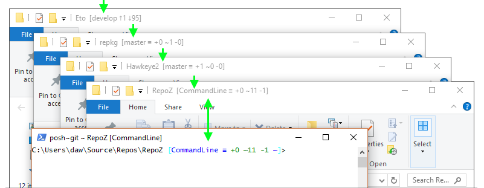

# WindowsExplorerTitle

As an extra goodie for Windows users, RepoM automatically detects open File Explorer windows and adds a status appendix to their title if they are in context of a git repository.

To use this module, make sure it is enabled in RepoM by opening the menu and navigate to 'Plugins'. After enabling or disabling a plugin, you should restart RepoM.

## Configuration

This plugin has no configuration.

Note that for Windows 11 users, the title will not be updated but in the taskbar the additional git information is still visible.
