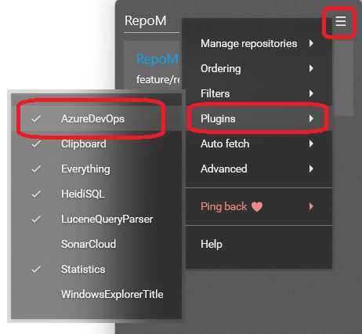

# Plugins

To use a module (plugin), make sure it is enabled in RepoM by opening the menu and navigate to 'Plugins'.

You have to restart RepoM when enabling or disabling a plugin.

## Plugin configuration

Some plugins require specific configuration to run correctly.
Plugins are responsible for creating specific plugin configuration files which can be edited manually. These configuration files are placed in the placed in the `%APPDATA%/RepoM/Module/` directory and each plugin has its own file.

When changing a file, a reboot of RepoM is most likely required.

## Plugin installation

Currently, all plugins sources are within the RepoM repository and there is no documented solution for writing and maintaining your own (private) plugins. This might chnage in the future. 
